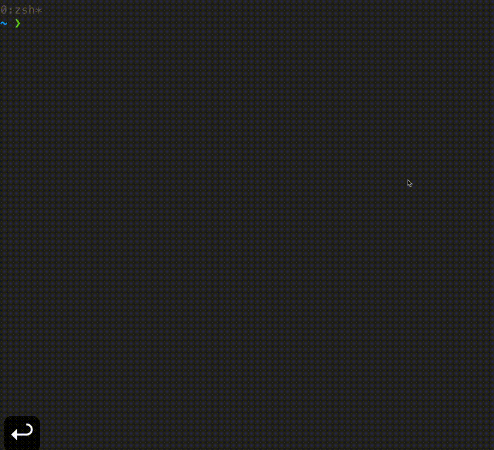
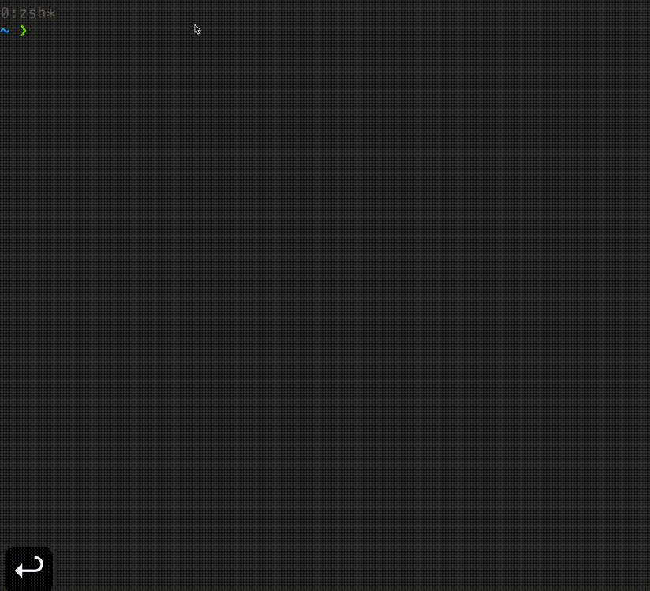
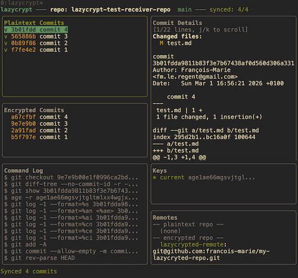
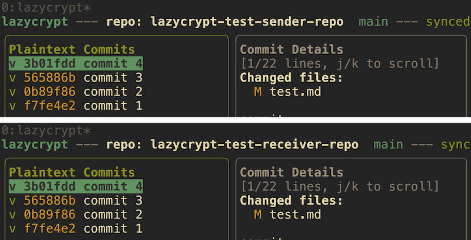

# Lazycrypt

A terminal UI for managing encrypted git histories, inspired by [lazygit](https://github.com/jesseduffield/lazygit). Built with [Bubble Tea](https://github.com/charmbracelet/bubbletea) and [age](https://github.com/FiloSottile/age) encryption.

Encrypt files and send them on a lazycrypted remote:



Decrypt the remote and recover your commits:



What it looks like:



## Table of Contents

- [Lazycrypt](#lazycrypt)
  - [Table of Contents](#table-of-contents)
  - [Elevator pitch](#elevator-pitch)
  - [Features](#features)
  - [Tutorials](#tutorials)
    - [Sender workflow](#sender-workflow)
    - [Receiver workflow](#receiver-workflow)
  - [Installation](#installation)
    - [Prerequisites](#prerequisites)
    - [Build from source](#build-from-source)
    - [Go install](#go-install)
  - [Usage](#usage)
    - [Key bindings](#key-bindings)
    - [Panels](#panels)
    - [Storage layout](#storage-layout)
  - [Configuration](#configuration)
  - [Architecture](#architecture)
    - [What is encrypted per commit](#what-is-encrypted-per-commit)
    - [Commit hash preservation](#commit-hash-preservation)
  - [Security](#security)
  - [Contributing](#contributing)
    - [Development](#development)
    - [Testing](#testing)
    - [Guidelines](#guidelines)
    - [Reporting issues](#reporting-issues)
  - [FAQ](#faq)
  - [Alternatives](#alternatives)
    - [git-remote-gcrypt](#git-remote-gcrypt)
    - [git-crypt](#git-crypt)
    - [git-secret](#git-secret)
    - [BlackBox](#blackbox)
    - [transcrypt](#transcrypt)

## Elevator pitch

You push code to GitHub. Your entire history is public. Every commit message, every file change, every secret you forgot to rotate, all sitting there in plaintext for anyone to read.
Sure, you can make the repo private, but "private" just means you trust GitHub (and by extension Microsoft, their employees, and any future acquirer) not to look at your data. That is not privacy, that is a policy promise.

Lazycrypt turns GitHub into your personal free encrypted cloud storage. Push as much as you want, to as many remotes as you want, nobody can read a thing without your key.

It maintains two parallel git histories. Your plaintext history stays local and trusted. An encrypted mirror, where every file is encrypted with [age](https://github.com/FiloSottile/age), gets pushed to untrusted remotes.
Commit messages are preserved, but all file content is opaque.
git-crypt and similar tools only encrypt specific files within your existing repo, leaving unprotected files in plaintext alongside encrypted ones. (You can encrypt the full repo with git-crypt, but it was not designed for that.) Lazycrypt encrypts all file content in the mirror. Nothing is readable without the key.

Need to rotate keys? Since plaintext is always available locally, just re-encrypt everything with a new key and rebuild the encrypted history. No complex key management ceremonies.

All of this wrapped in a lazygit-style TUI so you never have to remember the right sequence of commands.

## Features

- **Dual git histories**: plaintext (local) and encrypted (remote) repos managed side-by-side
- **age encryption**: every file encrypted per-commit using [age](https://github.com/FiloSottile/age)
- **One-key init**: press `i` to create `.lazycrypt/`, generate an age key, and init the encrypted bare repo
- **Incremental sync**: press `s` to encrypt new commits, tracked via a commit-map
- **Trivial re-keying**: press `R` twice to generate a new key and rebuild the entire encrypted history
- **Push to untrusted remotes**: press `p` to push the encrypted repo (e.g. to GitHub or any remote)
- **lazygit-style TUI**: panel-based layout with keyboard navigation (tab, j/k, arrows)
- **Commit-level mapping**: each plaintext commit maps 1:1 to an encrypted commit
- **Exclude patterns**: skip binary or large files from encryption via config
- **No custom git filters**: works with standard git and age CLI tools

## Tutorials

Lazycrypt has two workflows: **sender** (encrypt and push) and **receiver** (pull and decrypt). They are independent: the sender encrypts a local repo and pushes it, the receiver clones the encrypted remote and decrypts it.

### Sender workflow


The sender has a normal git repo with plaintext commits. Lazycrypt creates an encrypted mirror and pushes it to an untrusted remote (e.g. GitHub).

```
Plaintext repo (local)          Encrypted repo (.lazycrypt/encrypted.git)
  commit A  ----sync---->         enc_commit A  (all files age-encrypted)
  commit B  ----sync---->         enc_commit B
  commit C  (pending)             ...
                                         |
                                         +----push---->  GitHub (encrypted)
```

Step by step:

1. Work in your repo normally: commit with `git` as usual
2. Run `lazycrypt` inside the repo
3. Press `i` to initialize (first time only, creates `.lazycrypt/`, generates age keypair, inits the encrypted bare repo)
4. Press `e` to add an encrypted remote (name + URL, e.g. `git@github.com:you/repo-encrypted.git`)
5. Press `s` to sync: encrypts all unsynced plaintext commits into the encrypted mirror
6. Press `p` to push the encrypted repo to the remote
7. Repeat steps 5-6 as you make new commits

Each sync is incremental: only new commits are encrypted. The commit-map tracks which plaintext commits have been synced.

To share access with a receiver, send them:

- The encrypted remote URL
- A copy of your age private key (`.lazycrypt/keys/current.key`) via a secure channel

### Receiver workflow


The receiver starts with an empty repo and reconstructs the plaintext history from the encrypted remote using the sender's age private key.

```
GitHub (encrypted)          Local repo (receiver)
  enc_commit A  ----pull + decrypt---->  commit A  (plaintext restored)
  enc_commit B  ----pull + decrypt---->  commit B
  ...                                    ...
```

Step by step:

1. Create and enter a new git repo:
   ```bash
   mkdir my-repo && cd my-repo
   git init
   ```
2. Run `lazycrypt`
3. Press `i` to initialize
4. Press `e` to add the encrypted remote (the URL shared by the sender)
5. Press `D` to pull and decrypt: enter the path to the age private key shared by the sender
6. Lazycrypt clones the encrypted repo, decrypts each commit, and creates a plaintext git history locally

After decryption, the receiver has a full plaintext repo with all commits, authors, and dates preserved.

## Installation

Lazycrypt is not yet available through package managers like `brew` or `apt`. That is on the roadmap. For now, install from source or with `go install`.

### Prerequisites

- [Go](https://go.dev/dl/) 1.21+
- [git](https://git-scm.com/)
- [age](https://github.com/FiloSottile/age): install with your package manager:

```bash
# macOS
brew install age

# Ubuntu/Debian
apt install age

# Arch
pacman -S age
```

### Build from source

```bash
git clone https://github.com/francois-marie/lazycrypt.git
cd lazycrypt
go build -o lazycrypt .
```

The binary is built in the current directory. If `~/go/bin` is not already on your PATH, add this to your `~/.zshrc` or `~/.bashrc`:

```bash
export PATH="$PATH:$HOME/go/bin"
```

Then use `go install` (see below) or move the binary there manually:

```bash
mv lazycrypt ~/go/bin/
```

### Go install

```bash
go install github.com/francois-marie/lazycrypt@latest
```

## Usage

Run `lazycrypt` inside any git repository:

```bash
cd your-repo
lazycrypt
```

### Key bindings

| Key            | Action                                                              |
|----------------|---------------------------------------------------------------------|
| `tab`/`shift+tab` | Switch panel                                                    |
| `j`/`k` or arrows | Navigate within panel                                           |
| `i`            | Init lazycrypt (create `.lazycrypt/`, generate age key, init bare repo) |
| `s`            | Sync new plaintext commits to encrypted mirror                      |
| `e`            | Configure encrypted remote (name + URL)                             |
| `p`            | Push encrypted repo to remote                                       |
| `D`            | Pull & decrypt (receiver workflow)                                  |
| `r`            | Reload data                                                         |
| `R` (twice)    | Re-key: generate new key, rebuild encrypted history                 |
| `?`            | Toggle help                                                         |
| `q`            | Quit                                                                |

### Panels

| Panel              | Content                                            |
|--------------------|----------------------------------------------------|
| Plaintext Commits  | Plaintext commit history with sync status (v / ~)  |
| Encrypted Commits  | Encrypted commit history + pending count            |
| Files              | Files changed in selected commit                    |
| Keys               | age keys (current + retired)                        |
| Remotes            | Configured plaintext / encrypted remotes            |

### Storage layout

```
.lazycrypt/
  config.yml           # remotes, key paths, exclude patterns (0644)
  keys/
    current.key        # active age private key (0600)
    retired-*.key      # old keys after re-key (0600)
  commit-map           # "plaintext-sha:encrypted-sha" per line
  encrypted.git/       # bare git repo with encrypted content
```

Private key files (`current.key`, `retired-*.key`) are created with `0600` permissions (owner read/write only). The `.lazycrypt/` directory is added to `.gitignore` during init so keys and encrypted repo data are never committed by accident.

## Configuration

Configuration lives in `.lazycrypt/config.yml`, created by `lazycrypt init`:

```yaml
version: 1
current_key: .lazycrypt/keys/current.key
encrypted_remote:
  name: encrypted
  url: ""
exclude_patterns:
  - "*.png"
  - "*.jpg"
```

| Field              | Description                                         |
|--------------------|-----------------------------------------------------|
| `version`          | Config format version                               |
| `current_key`      | Path to the active age private key                  |
| `encrypted_remote` | Remote name and URL for the encrypted repo          |
| `exclude_patterns` | Glob patterns for files to skip during encryption   |

To point the encrypted repo at a remote, set the `url` field:

```yaml
encrypted_remote:
  name: encrypted
  url: "git@github.com:youruser/yourrepo-encrypted.git"
```

## Architecture

Lazycrypt is a single-file Go application (`main.go`). This is intentional: the entire codebase is one file with no internal packages, which makes it straightforward to audit. The structure:

| Section | Description |
|---------|-------------|
| Data types | `Config`, `Commit`, `FileChange`, `Key`, `Remote`, `PrereqStatus`, `CommitMap` |
| Path helpers | Functions returning `.lazycrypt/` subdirectory paths |
| Git helpers | Read-only queries against the plaintext and encrypted repos |
| Age helpers | `ageEncrypt` and `ageDecrypt` thin wrappers around the `age` CLI |
| Commands | `performInit`, `performSync`, `performRekey`, `performPush`, `performPullDecrypt` |
| TUI model | Bubble Tea model, update loop, and view rendering |

All git and age operations shell out to the system binaries (no Go crypto libraries). This keeps the trust boundary small: you only need to trust `age` and `git`, both widely audited.

### What is encrypted per commit

When lazycrypt syncs a plaintext commit to the encrypted mirror, it encrypts **all file content** with age. The following commit metadata is kept in plaintext in the encrypted repo:

| Preserved (plaintext)     | Encrypted             |
|---------------------------|-----------------------|
| Commit message            | All file contents     |
| Author name and email     |                       |
| Author date               |                       |
| Committer name and email  |                       |
| Committer date            |                       |
| File paths and tree structure |                   |
| Add/modify/delete status per file |               |

An observer with access to the encrypted remote can see commit messages, file paths, author/committer identities, and timestamps, but cannot read any file content without the age private key.

### Commit hash preservation

Lazycrypt preserves all four identity fields (author name/email, committer name/email) and both timestamps (author date, committer date) when replaying commits. This means the receiver's decrypted plaintext history has **identical commit hashes** to the sender's original, provided the file content is the same.

This works because git commit SHAs are computed from the tree (file content), parent hash, author, committer, and message. Preserving all of these exactly produces the same SHA on both sides.



A future version may offer an option to encrypt commit messages, file paths, or author/committer metadata. That would break hash preservation but give stronger privacy. For now, full hash preservation is the default.

## Security

- **Key file permissions**: Private keys are created with `0600` (owner-only) permissions. Lazycrypt never creates key files readable by group or others.
- **No plaintext on remotes**: The encrypted repo is the only thing pushed. Your plaintext history never leaves your machine unless you push it yourself.
- **Read-only on plaintext**: Lazycrypt never modifies your plaintext git history. The only change to your working directory is adding `.lazycrypt` to `.gitignore` during init.
- **`.lazycrypt/` is gitignored**: Added to `.gitignore` automatically so keys and the encrypted bare repo are never committed by accident.
- **Force push by design**: The encrypted repo uses `git push:force` because it is a derived, non-collaborative history. After a re-key the entire encrypted history is rebuilt from scratch, so force push is expected.
- **Key rotation**: Re-keying generates a fresh age keypair, moves the old key to `retired-*.key`, and rebuilds the encrypted history from the plaintext source. Old keys are kept locally for reference but are never used again.
- **No secrets in config**: `.lazycrypt/config.yml` stores paths and remote URLs only. Private key material lives in the key files.
- **Single-user model**: Lazycrypt is designed for one person. There is no key-sharing protocol. To share access, distribute the age private key out of band.

## Contributing

Contributions are welcome. The entire application lives in a single file (`main.go`) by design.

### Development

```bash
git clone https://github.com/francois-marie/lazycrypt.git
cd lazycrypt
go mod tidy
make build
```

### Testing

```bash
# Run all tests
make test

# Run tests with coverage report
make coverage

# Run linter
make lint
```

### Guidelines

- Keep everything in `main.go` (no package split needed for now)
- Follow existing code style
- All new logic must have unit tests in `main_test.go`
- Run `make test && make lint` before submitting changes

### Reporting issues

Open an issue on GitHub with:

- What you expected to happen
- What actually happened
- Steps to reproduce
- OS and Go version

## FAQ

**Q: How is this different from git-crypt?**

git-crypt encrypts specific files in-place within a single git history using GPG. Lazycrypt maintains a completely separate encrypted history where all file content is encrypted with age. The encrypted repo reveals nothing about the plaintext content beyond file paths and commit metadata.

**Q: Can collaborators decrypt the repo?**

Lazycrypt is designed for single-user workflows. The age private key stays local. Sharing requires distributing the key out of band.

**Q: What happens if I lose my plaintext repo?**

You need the age private key (`current.key`) to decrypt files from the encrypted repo. The encrypted repo alone is useless without the key. Back up your `.lazycrypt/keys/` directory securely.

**Q: Does re-keying change the encrypted commit hashes?**

Yes. Re-keying rebuilds the entire encrypted history from scratch, producing new hashes for every commit.

**Q: Can I exclude files from encryption?**

Yes. Add glob patterns to `exclude_patterns` in `.lazycrypt/config.yml`. Matched files are skipped during sync.

**Q: Does lazycrypt modify my plaintext repo?**

No. Lazycrypt is read-only with respect to your plaintext git history. It only adds `.lazycrypt` to `.gitignore` during init.

## Alternatives

| Tool | Approach | Encryption scope | Key mgmt | GitHub-friendly |
|------|----------|-----------------|----------|-----------------|
| **lazycrypt** | Separate encrypted mirror repo | All file content, per commit | age (simple) | Yes (incremental) |
| git-remote-gcrypt | Encrypted git remote | Entire repo (all objects + metadata) | GPG | No (repo bloat) |
| git-crypt | In-place file filter | Selected files only | GPG | Yes |
| git-secret | Pre-commit encryption | Selected files only | GPG | Yes |
| BlackBox | Pre-commit encryption | Selected files only | GPG | Yes |
| transcrypt | In-place file filter | Selected files only | OpenSSL | Yes |

### [git-remote-gcrypt](https://github.com/spwhitton/git-remote-gcrypt)

The closest alternative in spirit: it encrypts the entire repository, not just selected files. But it re-encrypts the whole git object database on every push, producing large encrypted packs. This makes it impractical for GitHub: the remote grows quickly and pushes become slow. Lazycrypt avoids this by encrypting file content individually per commit, so only new commits need processing and the encrypted repo stays a normal git repo with incremental pushes.

### [git-crypt](https://github.com/AGWA/git-crypt)

Encrypts selected files in-place within your existing repo using git clean/smudge filters. Requires GPG for key management, `.gitattributes` patterns to mark which files to encrypt, and careful coordination when adding collaborators. Files you do not mark remain in plaintext. Re-keying is not straightforward: you cannot rotate keys without rewriting history. Lazycrypt encrypts all file content by default, uses age (no GPG needed), and re-keying is a single command.

### [git-secret](https://github.com/sobolevn/git-secret)

A bash wrapper around GPG that encrypts selected files before committing. You must manually list files to protect and re-encrypt after each change. Requires all collaborators to share GPG keys. Only protects explicitly listed files; everything else stays in plaintext.

### [BlackBox](https://github.com/StackExchange/blackbox)

Similar to git-secret: encrypts specific files with GPG before committing. Designed for secrets (API keys, certs), not for encrypting entire repo content. Requires GPG key management across team members.

### [transcrypt](https://github.com/elasticdog/transcrypt)

Uses OpenSSL instead of GPG for in-place file encryption via git filters. Simpler key setup than git-crypt (a single password), but still only encrypts files matching patterns in `.gitattributes`. Unmatched files remain in plaintext.
